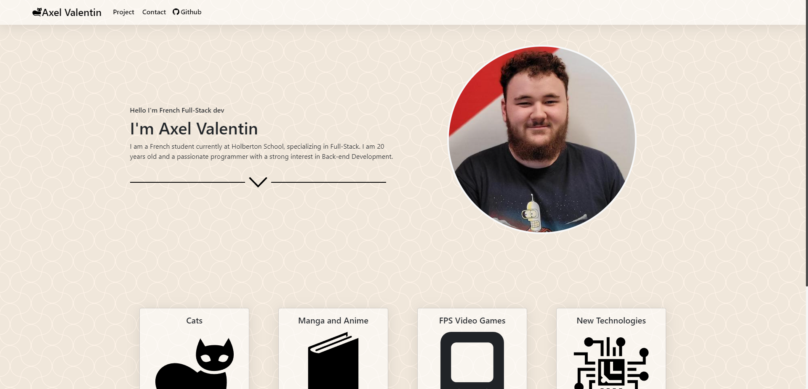

# Hi, I'm Axel Valentin! 👋

Welcome to my portfolio! Here you will find a collection of my past projects and experiences. I am excited to share my skills and knowledge with you, and I look forward to connecting with you. Please feel free to contact me if you have any questions or would like to collaborate on a project.

## Tools I used for my portfolio

- HTML 5
- CSS 3
- JavaScript
- React
- Bootstrap
- VS Code

## Installation

To run my portfolio project locally, follow these steps:

1. Clone the repository: `git@github.com:Pixeloceax/Portfolio.git`
2. Install the dependencies: `npm install`
3. Start the development server: `npm start`
4. The server will be running on `http://localhost:3000`.
